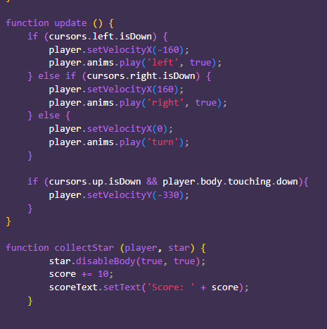
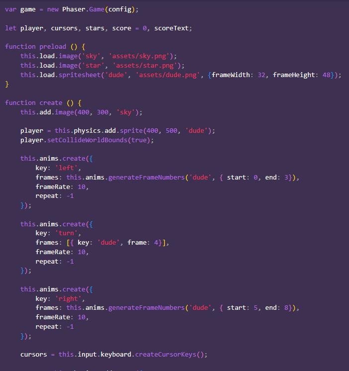

# Tool Learning Log

## Tool: **Phaser**

## Project: **Data Protection Game**

---

### 10/27/25:
* Started to create my own mini-games as a way to test my knowledge with what I have learned
* Used the properties of animation and actions to see what elements I would like to add into my game
*

### 11/15/25:
* Watched videos on Youtube to create games
    * Saw a few inspired as Pokemon or other acrade games
* Modified the version of Phaser's create your own game to my version

<!--
* Links you used today (websites, videos, etc)
* Things you tried, progress you made, etc
* Challenges, a-ha moments, etc
* Questions you still have
* What you're going to try next
-->
